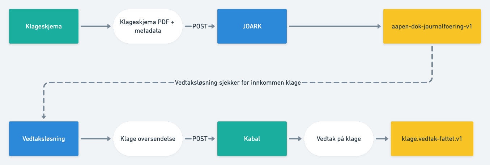

# Integrere med Kabal


## Kort fortalt

- Klage kommer inn via skjema på nav.no
- Klage arkiveres i JOARK
- Melding om innkommen klage sendes på JOARK sitt kafka-topic
- Førsteinstans håndterer klage i sin vedtaksløsning
- Dersom klage skal videre til klageinstans gjøres en POST på `kabal-api`
- Når klage er ferdig behandlet på klageinstans, legges en melding på et kafka-topic

### Oversende klage til Kabal

````
POST <kabal-api-url>/oversendelse/klage <oversendt-klage-json>
````
- DEV-url: `https://kabal-api.dev.nav.no`
- PROD-url: `https://kabal-api.intern.nav.no`

Skjema for oversendt klage kan finnes [her](https://kabal-api.dev.nav.no/swagger-ui/?urls.primaryName=external#/).

Eksempel
````
{
  "avsenderEnhet": "2312",
  "avsenderSaksbehandlerIdent": "W123456",
  "dvhReferanse": "687686978",
  "frist": "2021-04-26",
  "hjemler": [
    {
      "kapittel": 9,
      "lov": "FOLKETRYGDLOVEN",
      "paragraf": 1
    }
  ],
  "innsendtTilNav": "2021-04-26",
  "innsynUrl": "https://k9-sak.adeo.no/behandling/12345678",
  "kilde": "K9-sak",
  "kildeReferanse": "687687",
  "klager": {
    "id": {
      "type": "PERSON / VIRKSOMHET",
      "verdi": "12345678910"
    },
    "klagersProsessfullmektig": {
      "id": {
        "type": "PERSON / VIRKSOMHET",
        "verdi": "12345678910"
      },
      "skalKlagerMottaKopi": true
    }
  },
  "kommentar": "string",
  "mottattFoersteinstans": "2021-04-26",
  "oversendtEnhet": "4219",
  "sakReferanse": "576585",
  "sakenGjelder": {
    "id": {
      "type": "PERSON",
      "verdi": "12345678910"
    },
    "skalMottaKopi": true
  },
  "tema": "OMS",
  "tilknyttedeJournalposter": [
    {
      "journalpostId": "830498203",
      "type": "BRUKERS_KLAGE"
    }
  ],
  "type": "KLAGE"
}
````

### Klage-vedtak på Kafka

Skjema for klage-vedtak sendt på `klage.vedtak-fattet.v1` kan finnes [her](../schema/klagevedtak-fattet.json).

Eksempel
````
{
    "id": "1234",
    "utfall": "MEDHOLD",
    "vedtaksbrevReferanse": "34567657"
}
````
